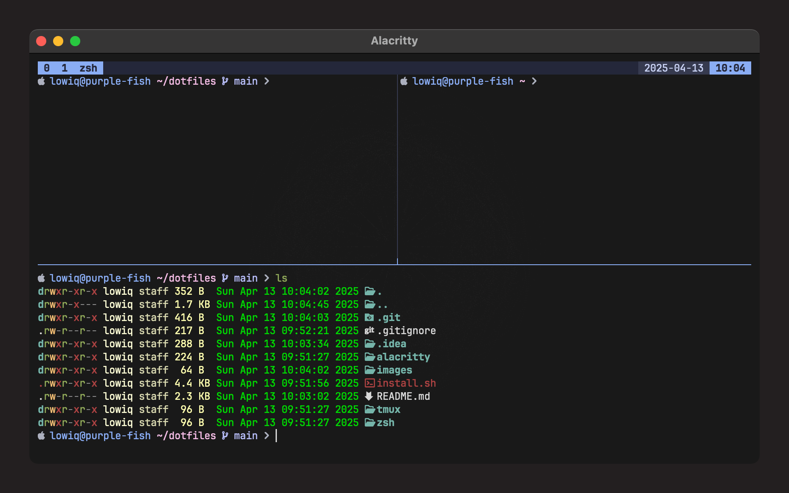

# Dotfiles

Customized configuration for zsh, tmux, and alacritty, inspired by PowerShell configuration with Oh My Posh.



## Overview

This dotfiles collection includes:

- **zsh**: Configuration with Oh My Posh, autosuggestions, syntax highlighting, and fzf
- **tmux**: Configuration with Catppuccin Macchiato theme and useful plugins
- **alacritty**: Configuration with Nerd Font support

## Prerequisites

- [Homebrew](https://brew.sh/) (for macOS)
- [Git](https://git-scm.com/)
- A [Nerd Font](https://www.nerdfonts.com/) (JetBrains Mono Nerd Font recommended)

## Installation

1. Clone this repository:
   ```bash
   git clone https://github.com/lxwiq/dotfiles.git ~/dotfiles
   ```

2. Run the installation script:
   ```bash
   cd ~/dotfiles
   chmod +x install.sh
   ./install.sh
   ```

3. Restart your terminal or reload your configuration:
   ```bash
   source ~/.zshrc
   ```

## Features

### ZSH

- Oh My Posh theme (catppuccin_macchiato)
- History-based autosuggestions
- Syntax highlighting
- fzf integration for searching
- Useful aliases and functions
- Quick navigation with z

### Tmux

- Catppuccin Macchiato theme
- Ctrl+A prefix
- Enhanced session and window management
- Productivity plugins
- Intuitive keyboard shortcuts
- Integration with vim/neovim

### Alacritty

- Nerd Font support
- Theme matching tmux and zsh configuration
- Optimized performance

## Keyboard Shortcuts

### ZSH

- `Ctrl+R`: Search history with fzf
- `Ctrl+F`: Search files with fzf
- `Alt+C`: Quick directory navigation with fzf

### Tmux

- `Ctrl+A`: Tmux prefix
- `Prefix + r`: Reload configuration
- `Prefix + v`: Vertical split
- `Prefix + h`: Horizontal split
- `Prefix + Ctrl+L`: Clear screen
- `Ctrl+h/j/k/l`: Navigate between panes

## Customization

You can customize these configurations by modifying the files in the `~/dotfiles` directory. After making changes, run the installation script again to update the symbolic links.

## Updates

To update your dotfiles:

1. Navigate to the dotfiles directory:
   ```bash
   cd ~/dotfiles
   ```

2. Pull the latest changes (if you cloned from a remote repository):
   ```bash
   git pull
   ```

3. Run the installation script:
   ```bash
   ./install.sh
   ```

## License

This project is licensed under the MIT License. See the LICENSE file for details.
